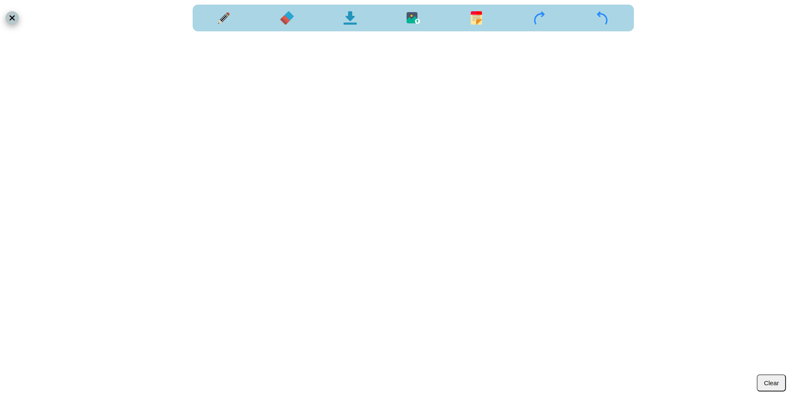
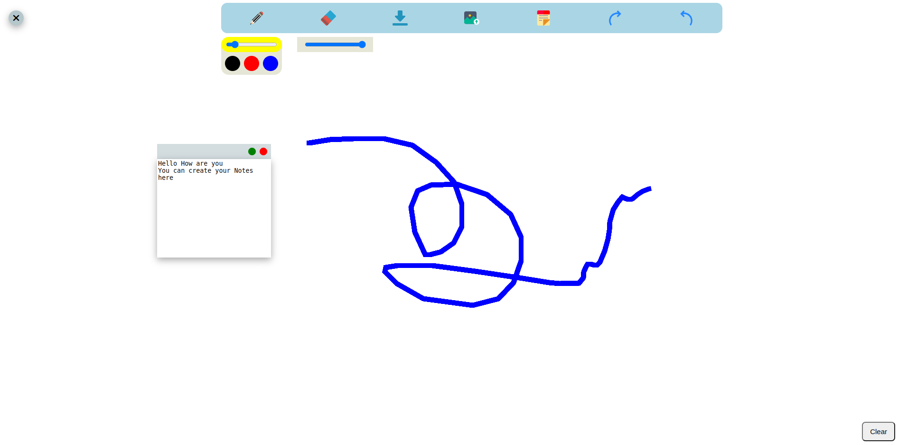

# OpenBoard Project

Welcome to OpenBoard, a dynamic web application built with HTML, CSS, and JavaScript that provides an interactive platform for users to express their ideas, sketch freely, and collaborate visually.

## Features

- **Sticky Notes:** Users can create digital sticky notes, making it convenient to jot down ideas or reminders.
- **Pen Tool:** The built-in pen tool allows users to draw and illustrate their thoughts on a blank canvas.
- **Eraser:** Correct mistakes easily with the eraser tool, maintaining a clean and organized workspace.
- **Color Palette:** Users have the flexibility to choose from a wide range of colors for their drawings and notes.
- **Screenshot Functionality:** Capture the current state of the canvas as an image for easy sharing and reference.
- **Image Import:** Import images directly onto the canvas, enhancing the visual elements of the board.
- **Undo/Redo:** The project offers an undo and redo feature, ensuring that no creative ideas are lost.
- **Full-Page Canvas:** Enjoy the freedom of a full-page canvas to unleash creativity without constraints.

## Tech Stack

- **HTML:** The backbone of the project, providing the structure and layout.
- **CSS:** Styling elements to create an intuitive and visually appealing user interface.
- **JavaScript:** Enabling interactive features, dynamic updates, and seamless user experiences.
- **Canvas API:** Leveraging HTML5's canvas element for drawing, sketching, and rendering.

## Usage

1. Clone the repository.
2. Open `index.html` in your preferred web browser.
3. Start using OpenBoard's features to create, draw, and collaborate!

## Future Enhancements

OpenBoard is an ongoing project, and future enhancements may include:

- Adding user accounts for personalized boards.
- Collaborative features, enabling real-time collaboration between users.
- Additional drawing tools and shapes to diversify creativity.
- Export options for saving boards in various formats.

Feel free to contribute and bring your ideas to OpenBoard's development!

## Screenshots

## License

This project is licensed under the [MIT License](LICENSE).
